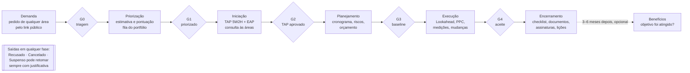
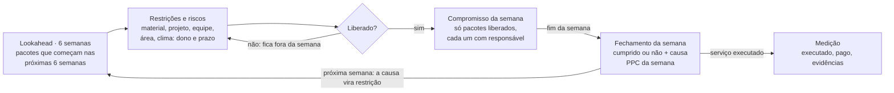

# Plano de Reestruturação — Gestão de Projetos e Obras

29/09/2026 · Wagner (Núcleo de Projetos / PMO — Hospital da Baleia)

> Cópia fiel do documento vivo do plano (Claude Docs), exportada em 29/09/2026.
> Situação de cada etapa: ver a coluna **Status** do roteiro e o arquivo `docs/CONTINUACAO.md`.

O sistema de obras vira uma plataforma de gestão de projetos (tipos Obra e Projeto) com um único ciclo Demanda → Encerramento, portões de aprovação, permissões configuráveis e o PMO como aprovador universal. A mudança sai em 12 etapas, cada uma testada numa cópia da planilha e aprovada em velocidade e uso no celular antes de ir para produção, e termina com o sistema completo: nenhuma tela "Em breve".

## Ponto de partida

O sistema já cobre o ciclo inteiro de uma obra, mas tem duas falhas graves e foi desenhado só para obra. Base: 35 arquivos, cerca de 8.800 linhas, planilha com 24 abas.

**O que já funciona e será mantido:** Pedidos com link público, cadastro 5W2H + EAP, publicação e manifestação das áreas, cronograma com etapas e pacotes, validação do PMO com Baseline, Lookahead, Compromisso Semanal (PPC), Pagamentos com Curva S, Encerramento com assinaturas, login individual por e-mail.

**O que precisava ser corrigido antes de crescer** (todos corrigidos nas etapas 1 e 2 — ver `docs/CONTINUACAO.md`):

| Problema | Impacto | Onde (código original) |
| --- | --- | --- |
| Funções de manutenção podem ser chamadas por qualquer pessoa na internet; `semearPrimeiroPmo()` devolve a senha do PMO | Qualquer um vira PMO | `Usuarios.gs:101` e outras 7 funções |
| Salvar um cronograma apaga e reescreve as abas Cronograma e Etapas de todas as obras | Erro no meio da gravação apaga os cronogramas de todas as obras | `Cronograma.gs:176`, `Obras.gs:156` |
| Papel Responsável consegue chamar funções de escrita de Engenharia/PMO pelo servidor | Alteração indevida de obras e pedidos | `Obras.gs`, `Pedidos.gs` |
| Cache sem proteção para o limite de 100 KB | Telas de listas param de abrir quando os dados crescem | 11 endpoints |
| Leitura da planilha sem reaproveitamento | Abrir uma obra lê 14 abas inteiras | `Obras.gs:48` |
| IDs com 3 dígitos e reaproveitados após exclusão | ID repetido a partir do 1000º registro do ano | `Helpers.gs:56` |
| Telas Usuários, Cronograma (visão PMO) e Execução não existem | Usuário só é criado editando a planilha | `Shell.html` |

## Sistema alvo

Obra e Projeto seguem o mesmo ciclo de seis fases, separadas por cinco portões de aprovação. Cada decisão de portão fica registrada com quem aprovou e por quê.

Todo projeto passa por 5 portões; o PMO aprova qualquer um. O tipo (Obra ou Projeto) define os módulos de cada fase.

| Portão | Libera a próxima fase quando |
| --- | --- |
| G0 Triagem | Tipo e área executora definidos; pedido aceito |
| G1 Priorização | Estimativa de custo e prazo, pontuação e fonte de recurso preenchidas; projeto entra no portfólio |
| G2 TAP aprovado | TAP e EAP completos; consulta às áreas encerrada (obrigatória para Obra) |
| G3 Baseline | Cronograma, riscos e orçamento validados; baseline congelada; ordem de início |
| G4 Aceite | Checklist, documentos e assinaturas completos; lições aprendidas registradas |

## Velocidade e responsividade

Velocidade e uso no celular são critérios de aceite de toda etapa: uma tela que não cumpre as metas abaixo não vai para produção.

| Meta | Como se chega lá |
| --- | --- |
| Qualquer tela abre em até 2 s numa rede 4G | Uma chamada ao servidor por tela; dados da última visita aparecem na hora e se atualizam em segundo plano |
| Salvar dá retorno visual imediato | A tela já mostra a mudança e confirma quando o servidor responde; em caso de erro, desfaz e avisa |
| Servidor responde rápido mesmo com milhares de linhas | Leitura de várias abas numa única requisição, memória por execução, cache com versão por aba, gravação só das linhas alteradas |
| Página leve | Partes pesadas (Gantt, Curva S, relatórios) carregam só quando abertas; sem bibliotecas grandes |
| Funciona bem num celular de 360 px de largura | Layout pensado primeiro para o celular; tabelas viram cartões; botões com área de toque de 44 px; nenhuma rolagem lateral da página |
| Listas longas não travam | Mostram 50 itens e "ver mais"; busca e filtros no próprio navegador |

Cada etapa mede o tempo de abertura das telas que alterou, antes e depois, e registra o resultado no roteiro.

## Tipos de projeto

Todo projeto passa pelas mesmas fases; o tipo decide quais módulos aparecem e quais são obrigatórios para passar no portão. A tabela abaixo é o ponto de partida e fica editável pela tela Configurações (aba `TiposProjeto`), então novos tipos entram sem mexer no código.

| Fase | Módulo | Obra | Projeto |
| --- | --- | --- | --- |
| Demanda | Pedido + triagem | obrigatório | obrigatório |
| Priorização | Estimativa, pontuação, fonte de recurso | obrigatório | obrigatório |
| Iniciação | TAP 5W2H + EAP | obrigatório | obrigatório |
| Iniciação | Consulta às áreas (manifestação) | obrigatório | opcional |
| Planejamento | Cronograma (etapas e pacotes) | obrigatório | obrigatório |
| Planejamento | Riscos e restrições | obrigatório | obrigatório |
| Planejamento | Orçamento e plano de pagamento | obrigatório | opcional |
| Execução | Lookahead e Compromisso Semanal (PPC) | obrigatório | opcional |
| Execução | Medições (execução, pagamento, evidências) e Curva S | obrigatório | opcional |
| Execução | Controle de mudanças | obrigatório | obrigatório |
| Encerramento | Checklist + documentos + assinaturas | obrigatório (as-built) | obrigatório (entrega/aceite) |
| Encerramento | Lições aprendidas | obrigatório | obrigatório |
| Benefícios | Avaliação 3–6 meses depois | opcional | opcional |

"Opcional" aparece na tela mas não trava o portão; um módulo pode também ser marcado como "oculto" para um tipo.

## Permissões e aprovações

Permissões seguem a lógica do sistema de eventos (perfil → módulo → ações), mas ficam numa aba da planilha editável pela tela Configurações e são checadas pelo servidor em toda chamada. O PMO aprova qualquer portão de qualquer tipo; a aba de aprovadores só dá esse direito a mais pessoas.

**Regras**

1. Cada usuário tem um perfil. Perfis iniciais: PMO, Engenharia, Responsável, Consulta. Novos perfis (ex.: Diretoria, TI) são criados na tela, sem código.
2. Ações possíveis por módulo: ler, criar, editar, excluir, aprovar. *(Implementado na etapa 3 como: ver, cadastrar e editar, excluir, cancelar, gerar — ver `docs/CONTINUACAO.md`.)*
3. Uma única função do servidor, `exigir_(token, modulo, acao)`, valida toda chamada. O menu usa a mesma regra: sem "ler", o item não aparece.
4. Aprovar um portão: PMO sempre pode; além dele, quem estiver na aba `Aprovadores` para aquele tipo e portão (por perfil ou por usuário).
5. Toda aprovação grava na aba `Gates`: quem, perfil, data, decisão e justificativa.
6. Sempre existe ao menos um PMO ativo: o sistema bloqueia desativar ou rebaixar o último.

**Matriz inicial** (ponto de partida; você ajusta na tela)

| Módulo | PMO | Engenharia | Responsável | Consulta |
| --- | --- | --- | --- | --- |
| Pedidos | tudo | ler, editar; aprovar se estiver em Aprovadores | — | ler |
| Projetos (TAP, EAP, consulta às áreas) | tudo | ler, criar, editar | — | ler |
| Áreas e impactos | tudo | ler, criar, editar | ler | ler |
| Cronograma, riscos, restrições | tudo | ler, criar, editar, excluir | ler (só os seus pacotes) | ler |
| Execução (Lookahead, Compromisso) | tudo | ler, criar, editar, excluir | marcar andamento dos seus pacotes | ler |
| Medições: declarar e anexar evidência | tudo | ler, criar, editar | — | ler |
| Medições: conferir e marcar pagamento | tudo | — | — | ler |
| Controle de mudanças | tudo | ler, criar | — | ler |
| Encerramento | tudo | ler, criar, editar | — | ler |
| Relatórios PDF e planilhas | tudo | gerar | — | gerar |
| Configurações (usuários, permissões, aprovadores, tipos, locais, marca) | tudo | — | — | — |

**Aprovadores iniciais**

| Portão | Obra | Projeto |
| --- | --- | --- |
| G0 Triagem | PMO, Engenharia | PMO |
| G1 Priorização | PMO | PMO |
| G2 TAP aprovado | PMO | PMO |
| G3 Baseline / ordem de início | PMO | PMO |
| G4 Aceite da entrega | PMO + solicitante (assinatura) | PMO + solicitante (assinatura) |

## Menu e módulos

O menu segue a ordem do trabalho: começa em Pedidos e termina em Encerramento, com o Painel no topo mostrando o estado de tudo. O visual (barra lateral escura, cartões, tipografia) vem do sistema de eventos; as telas continuam com a base segura do obras.

| # | Menu | Para que serve |
| --- | --- | --- |
| 1 | Painel | Estado de todos os pedidos e projetos, o que aguarda você e os alertas |
| 2 | Pedidos | Entrada de demandas; aprovação por quem o PMO definiu; PDF do pedido; conversão em projeto |
| 3 | Projetos | Cada projeto, do tipo Obra ou Projeto, aberto em abas por fase |
| 4 | Áreas e impactos | Memória de quem foi afetado em cada local, com contato do gestor, para prevenir o próximo projeto no mesmo lugar |
| 5 | Cronograma | Visão rápida (Gantt) de todos os projetos; a edição fica dentro do projeto |
| 6 | Execução | Projetos com cronograma validado e start dado: Lookahead, Compromisso Semanal, restrições e riscos |
| 7 | Medições | Declarar o que foi executado, por atividade ou fase, se foi pago e se falta documento |
| 8 | Encerramento | Processo de encerramento com relatório final e relatórios específicos |
| 9 | Relatórios | Todos os PDFs e planilhas num só lugar |
| 10 | Configurações | Criar usuários e redefinir senhas, perfis e permissões, aprovadores, tipos de projeto, locais, marca dos relatórios |

Os itens 4 a 8 mostram todos os projetos juntos; clicar num item abre o projeto na aba certa. Dentro do projeto as abas são: `Visão geral | Iniciação | Planejamento | Execução | Medições | Encerramento | Histórico`.

## Painel

O Painel responde em uma olhada: o que está esperando por mim, onde está cada pedido e projeto, e o que está em risco.

- **Aguardando você** (primeiro bloco): pedidos para aprovar, portões para aprovar, medições sem evidência, restrições que vencem nesta semana. Cada perfil vê só o que é dele.
- **Indicadores:** pedidos abertos, projetos por fase, projetos atrasados contra a baseline, PPC da semana, restrições em aberto, valor medido x pago.
- **Quadro por fase** (Pedido → Encerramento): cartões com título, tipo (Obra ou Projeto), responsável, próxima data e um sinal de situação (em dia, atenção, atrasado).
- **Filtros:** tipo, área executora, responsável e busca por nome ou código.
- **No celular:** o quadro vira uma lista agrupada por fase, com grupos que abrem e fecham; os indicadores ficam em duas colunas.

## Pedidos e aprovação

Todo projeto nasce de um pedido, e o pedido só vira projeto depois de aprovado por quem o PMO autorizou.

1. A área preenche o formulário público (link fixo), com o editor de texto com negrito nos campos longos.
2. O pedido entra como Novo e aparece em "Aguardando você" para os aprovadores definidos pelo PMO em Configurações → Aprovadores. O PMO sempre pode aprovar.
3. O aprovador pode pedir mais informações (o solicitante responde pelo link de acompanhamento), recusar com justificativa ou aprovar.
4. Ao aprovar, escolhe o tipo (Obra ou Projeto) e a área executora; o sistema cria o projeto com os dados do pedido já preenchidos. O pedido, na tela e no formulário público, tem a mesma cara do relatório: fundo branco, tópicos numerados separados por ondas, cabeçalho e rodapé.
5. **PDF do pedido** no padrão do eventos: cabeçalho com logo, seções numeradas (01 Solicitante, 02 Necessidade, 03 Urgência e justificativa, 04 Parecer e aprovação com quem aprovou e quando), marca d'água e rodapé com código do documento e página.

## Projetos

Um único cadastro para Obra e Projeto; o tipo decide quais módulos aparecem (seção Tipos de projeto).

- Cadastro 5W2H + EAP, como hoje, com o editor de texto com negrito.
- **Local exato** escolhido de uma lista (Setor › Bloco/andar › Ambiente). É esse campo que liga o projeto à memória de Áreas e impactos.
- Consulta às áreas (manifestação): obrigatória para Obra, opcional para Projeto.
- Cronograma editado na aba Planejamento, como hoje dentro de Obras.
- Portões G2 e G3 aprovados no cabeçalho do projeto; depois do G3, o botão **Dar start** registra a data real de início e leva o projeto para Execução.

## Áreas e impactos

Áreas e impactos é a memória institucional de cada local: quem foi afetado por qual projeto, o que incomodou, o que foi combinado e com quem falar. Quando um novo projeto cai no mesmo local, o sistema avisa antes e registra que o gestor foi consultado, o que resguarda o PMO.

**O que é guardado em cada registro de impacto**

| Campo | Exemplo |
| --- | --- |
| Local exato | Centro Cirúrgico › Bloco B, 2º andar › Sala 3 |
| Área e gestor afetados | CCIH · nome, cargo, telefone, e-mail |
| Projeto de origem | OBR-2026-014 Reforma da sala 3 |
| Tipo de impacto | Ruído, poeira, interrupção de energia, bloqueio de acesso, outro |
| O que a área exigiu ou combinou | "Obra só após 19h; barreira de poeira obrigatória" |
| Gravidade e resultado | Objeção, ressalva ou ciência; resolvido ou não |

**De onde vêm os registros**

- Automático: manifestações com ressalva ou objeção, requisitos, restrições da execução ligadas à área e objeções do encerramento.
- Manual: qualquer impacto informado por telefone, reunião ou e-mail.

**Como ele trabalha a seu favor**

1. Ao cadastrar um projeto e escolher o local, aparece o quadro "Histórico deste local": impactos anteriores no mesmo ambiente e no mesmo setor, com o contato de cada gestor.
2. O sistema sugere as áreas a consultar e já as inclui na consulta às áreas.
3. O contato feito fica registrado (data, quem, canal, resposta), como prova de que o gestor foi avisado.
4. A tela Áreas e impactos permite buscar por local, área ou gestor e ver o histórico completo.

As "áreas propostas" de hoje continuam aqui: um nome de área novo digitado numa manifestação entra como proposta e o PMO aprova ou rejeita.

## Cronograma

O menu Cronograma é uma visão rápida, só de leitura: o Gantt de todos os projetos com marcos, atraso contra a baseline e filtros por tipo e área. Para editar, abre-se o projeto na aba Planejamento, onde fica o editor de hoje.

## Execução

A Execução começa quando o PMO valida o cronograma (G3) e alguém dá o start. O objetivo do Lookahead e do Compromisso Semanal é antecipar riscos e impedimentos: nenhum pacote entra na semana com restrição pendente.

Impedimentos são resolvidos antes de o pacote entrar na semana.

**Uma tela "Semana" por projeto, em três colunas**, no lugar das telas separadas de hoje:

| Próximas 6 semanas | Esta semana | Fechamento |
| --- | --- | --- |
| Pacotes que vão começar, cada um com suas restrições e riscos; o pacote fica verde quando todas estão liberadas | Pacotes comprometidos, com responsável; só aceita pacote verde | Cumprido ou não; se não, a causa (lista padrão) e o detalhe |

- **Categorias de restrição:** material, projeto, mão de obra, equipamento, clima e liberação de área. A liberação de área já traz o contato do gestor a partir de Áreas e impactos.
- **Alertas no Painel:** restrição que vence sem ter sido liberada, pacote que começa em até 2 semanas ainda com restrição, risco sem plano de ação.
- **Aprendizado:** a causa de um não cumprimento pode virar, com um clique, uma restrição ou um risco para as próximas semanas. O PPC mostra a tendência e as causas mais frequentes.
- **Controle de mudanças:** mudança de escopo, prazo ou custo é solicitada, aprovada pelo PMO e gera uma nova versão da baseline, sem apagar a anterior.
- O menu Execução mostra a mesma tela para todos os projetos juntos; o responsável de campo vê só os pacotes dele e marca o andamento pelo celular.

## Medições

Medição é a declaração de que um serviço foi executado (ou não), ligada a uma ou mais atividades ou a uma fase inteira, com a situação do pagamento e as evidências. O histórico de medições mostra o andamento real do projeto.

| Campo | Opções / conteúdo |
| --- | --- |
| Refere-se a | Uma ou mais atividades do cronograma, ou uma fase (etapa) inteira |
| Execução | Realizado, parcial (com %), não realizado |
| Descrição do serviço | Texto com negrito; período de referência |
| Valor medido | R$ (opcional para Projeto) |
| Pagamento | A pagar, pago (data e nº da nota), bloqueado por falta de documento |
| Documento faltante | Qual documento falta e de quem é a pendência |
| Evidências | Arquivos enviados ou links (fotos, notas fiscais, relatórios) |
| Conferência | Aprovada ou devolvida pelo PMO, com observação |

- Uma atividade pode receber várias medições ao longo do tempo; o sistema soma o que já foi medido e mostra o saldo.
- Na aba Medições do projeto: lista por fase e atividade com os sinais medido, pago e pendência de documento.
- No menu Medições: todas as medições de todos os projetos, com filtro "a pagar" e "falta documento".
- A Curva S passa a mostrar três linhas: planejado (baseline), medido e pago.
- Relatório PDF de medições por período, com as evidências listadas.

## Encerramento e relatórios PDF

O encerramento é um processo guiado (checklist, documentos, assinaturas, lições) que termina com relatórios em PDF no mesmo padrão executivo do sistema de eventos.

**Motor de relatórios (reaproveitado do eventos)**

- Documento A4 em HTML com seções numeradas ("01 • ..."), tabelas com cabeçalho azul-marinho e marca d'água. Cabeçalho em todas as páginas: logo, nome do relatório, código e título do projeto, data e hora de emissão e quem emitiu. Rodapé em todas as páginas: texto institucional, logo do rodapé, código do documento e "página X de Y".
- Prévia na tela; "Gerar PDF" usa a impressão do navegador, então o PDF sai idêntico à prévia, leve e com texto selecionável. Também exporta planilha (CSV para Excel).
- Marca configurável em Configurações → Marca dos relatórios: logo do cabeçalho, marca d'água, logo do rodapé e texto do rodapé. As imagens vão embutidas no documento, sem depender de link público.
- Os textos com negrito saem formatados no PDF.

**Relatórios**

| Relatório | Onde se gera | Conteúdo |
| --- | --- | --- |
| Pedido | Pedidos | Solicitante, necessidade, urgência, parecer e aprovação |
| Ficha do projeto (TAP) | Projeto → Iniciação | 5W2H, EAP, local, consulta às áreas e manifestações |
| Situação do projeto | Projeto → Visão geral | Fase, portões, cronograma x baseline, riscos, restrições, medições |
| Semana de execução | Execução | Lookahead de 6 semanas, compromissos, PPC e causas de não cumprimento |
| Medições e pagamentos | Medições | Medido, pago, pendências de documento, Curva S |
| Relatório final do projeto | Encerramento | Resumo do projeto do pedido ao aceite: prazo e custo previstos x realizados, mudanças, impactos, lições |
| Termo de aceite | Encerramento | Itens entregues e assinaturas |
| Checklist e pendências | Encerramento | Inspeção técnica, qualidade, objeções e o que ficou pendente |
| Dossiê de documentos | Encerramento | Lista de documentos e as-built com links |
| Lições aprendidas | Encerramento / Relatórios | Por projeto ou por tipo de projeto |
| Panorama do portfólio | Relatórios | Todos os projetos por fase, tipo e área executora |
| Impactos por local | Áreas e impactos | Histórico de um local ou de uma área, com contatos |
| Histórico do projeto | Projeto → Histórico | Onde o projeto está agora e a linha do tempo completa do pedido ao encerramento: cada fase e portão, decisões, mudanças, restrições liberadas, medições e assinaturas, com quem fez, quando e o que foi decidido |

## Editor de texto com negrito

O editor atual fica: ele mostra negrito, itálico, destaque e listas enquanto se digita, mas grava só texto simples na planilha, o que o torna seguro contra código malicioso nos formulários públicos. As melhorias usam o mesmo mecanismo, sem remendos.

- Um único componente, usado em todos os campos longos (pedido, projeto, manifestação, restrição, medição, encerramento).
- Atalhos Ctrl+B e Ctrl+I, e barra de botões com tamanho de toque confortável no celular.
- Colar de Word, e-mail ou WhatsApp traz o texto limpo, mantendo negrito e listas.
- Contador de caracteres com o limite do campo.
- A mesma formatação aparece na tela, na página pública e no PDF.

## Modelo de dados

A planilha continua sendo o banco e nenhuma aba existente é renomeada ou apagada: as mudanças são colunas no fim das abas atuais e abas novas. A aba `Obras` mantém o nome e passa a guardar todos os projetos; na tela ela se chama Projetos.

**Colunas novas em abas existentes**

| Aba | Colunas adicionadas | Para quê |
| --- | --- | --- |
| Obras | `Tipo`, `AreaExecutora`, `FaseAtual`, `IDLocal`, `Prioridade`, `DataStart`, `SuspensoEm`, `SuspensoPor`, `MotivoSuspensao` | Projeto genérico, fase única, local exato, start, suspensão |
| Pedidos | `Tipo`, `AreaExecutora`, `IDLocal`, `NotaPrioridade`, `CustoEstimado`, `PrazoEstimado`, `FonteRecurso`, `AprovadoPor`, `AprovadoEm` | Aprovação e priorização |
| Usuarios | `Perfil` (substitui `Papel`, com o mesmo valor na migração), `Telefone` | Perfis configuráveis |
| Medicoes | `StatusExecucao`, `PercentualExecutado`, `StatusPagamento`, `DataPagamento`, `NotaFiscal`, `DocumentoFaltante`, `PeriodoReferencia` | Execução, pagamento e pendência de documento |
| Restricoes | `IDArea`, `ContatoFeito` | Liberação de área ligada ao gestor |
| Baseline | `Versao` | Rebaseline após mudança aprovada |

**Abas novas**

| Aba | Colunas | Para quê |
| --- | --- | --- |
| Gates | ID, IDProjeto, Portao, Decisao, Justificativa, DecididoPor, PerfilDecisor, DecididoEm | Histórico de todas as aprovações, inclusive de pedidos |
| Mudancas | ID, IDProjeto, Categoria (escopo/prazo/custo), Descricao, Impacto, Status, SolicitadoPor, SolicitadoEm, DecididoPor, DecididoEm, VersaoBaseline | Controle de mudanças |
| MedicoesItens | IDMedicao, IDPacote ou IDEtapa, Valor, Percentual | Uma medição ligada a várias atividades ou a uma fase |
| Locais | ID, Setor, BlocoAndar, Ambiente, Ativo | Lista do local exato (Setor › Bloco/andar › Ambiente) |
| Areas | ID, Nome, Gestor, Cargo, Telefone, Email, Status (proposta/aprovada) | Áreas, gestores e contatos (inclui as áreas propostas) |
| Impactos | ID, IDLocal, IDArea, IDProjeto, Tipo, Descricao, Exigencia, Gravidade, Resolvido, Origem, RegistradoPor, RegistradoEm | Memória de impactos por local |
| ContatosArea | ID, IDProjeto, IDArea, Data, Canal, FeitoPor, Resposta | Prova de que o gestor foi avisado |
| TiposProjeto | Tipo, Fase, Modulo, Regra (obrigatório/opcional/oculto) | O que cada tipo usa |
| Perfis | Perfil, Descricao, Ativo | Lista de perfis *(implementado dentro da aba `Permissoes` — ver CONTINUACAO)* |
| Permissoes | Perfil, Modulo, Acoes | Matriz de permissões *(implementado: Perfil, Permissoes "modulo.acao,…", Descricao, AtualizadoPor, AtualizadoEm)* |
| Aprovadores | Tipo, Portao, Perfil, UsuarioId | Quem aprova além do PMO *(implementado)* |
| CriteriosPrioridade | Criterio, Peso, Escala | Pontuação da priorização |
| LicoesAprendidas | ID, IDProjeto, Categoria, Descricao, Recomendacao, Autor, CriadoEm | Encerramento |
| Beneficios | ID, IDProjeto, ObjetivoOriginal, Atingido, Evidencia, AvaliadoPor, AvaliadoEm | Avaliação pós-projeto |
| Auditoria | Timestamp, Usuario, Acao, Aba, IDRegistro, Resumo | Registro de toda escrita |

A marca dos relatórios (logos, marca d'água, texto do rodapé) fica na aba `Config` já existente, com as imagens guardadas no Drive, como no eventos.

**Regras técnicas que valem para todas as abas**

- IDs nunca reaproveitados (contador guardado nas propriedades do script) e sem teto. *(Implementado: `PREFIXO-ANO-NNN` com no mínimo 3 dígitos, crescendo para 1000+ — mantém o formato dos IDs existentes.)*
- Nenhuma gravação apaga uma aba inteira: só as linhas do projeto afetado são escritas.
- Toda escrita roda sob trava (`LockService`) e grava uma linha em `Auditoria`. *(Trava: feito. Auditoria: pendente.)*
- Exclusões passam a ser lógicas (coluna de status), exceto anexos enviados por engano.

## Roteiro de execução

São 12 etapas. As etapas 0 a 5 são a fundação e seguem em sequência; as etapas 6 a 10 seguem a ordem do menu e podem se sobrepor quando uma não depende da outra. Toda etapa só vai para produção depois de passar no critério de aceite e nas metas de velocidade e celular. Tamanho: P = pequena, M = média, G = grande.

| # | Etapa | Entregas | Critério de aceite | Depende de | Tamanho | Status |
| --- | --- | --- | --- | --- | --- | --- |
| 0 | Preparação | Cópia da planilha para homologação; implantação de teste separada; código no repositório como fonte única; backup da produção; medição do tempo atual de cada tela | Homologação abre com os dados copiados; tempos de hoje registrados | — | P | Em andamento |
| 1 | Segurança e integridade | Funções de manutenção só pelo editor; servidor exige permissão em toda escrita; cronograma e EAP gravam só as linhas do projeto; cache protegido; IDs sem reaproveitar; trava nas escritas; último PMO protegido | Chamada anônima a `semearPrimeiroPmo` recusada; salvar a obra A não altera a obra B; listas com 1.500 registros abrem | 0 | M | Em homologação |
| 2 | Base técnica e velocidade | Camada de dados única (leitura em lote, memória por execução, cache com versão, gravação por linha, auditoria); padrão de tela que abre com dados guardados e atualiza em segundo plano; testes embutidos | Telas atuais abrem em até 2 s em 4G; todos os testes passam | 1 | G | Em homologação |
| 3 | Usuários, permissões e aprovadores | Tela Configurações: criar usuário, redefinir senha, ativar/desativar; perfis e matriz de permissões; aprovadores por tipo e portão; troca da própria senha | Usuário criado pela tela entra no sistema; perfil sem permissão não vê o menu nem consegue chamar o servidor | 2 | M | Em homologação |
| 4 | Visual novo, responsivo, e Painel | Casca no visual do eventos; menu na ordem nova; projeto em abas; Painel com "Aguardando você", indicadores e quadro por fase; editor de texto como componente único | Todas as telas de hoje funcionam no layout novo em 360 px sem rolagem lateral; Painel abre em até 2 s | 3 | G | Em andamento |
| 5 | Projetos genéricos, fases e portões | Tipo (Obra/Projeto), FaseAtual, Gates, TiposProjeto, local exato, botão Aprovar portão, Dar start, Suspender; migração dos status | Todos os projetos migrados na fase certa (relatório conferido); portão bloqueia sem módulos obrigatórios | 4 | G | Não iniciada |
| 6 | Pedidos com aprovação e PDF | Aprovação conforme Aprovadores; pedir informação, recusar, aprovar e converter em Obra ou Projeto; motor de relatórios do eventos com marca configurável; PDF do pedido; relatório de histórico do projeto | Pedido percorre Novo → Aprovado → Projeto criado, com histórico em Gates; PDF idêntico à prévia | 5 | M | Não iniciada |
| 7 | Áreas e impactos | Cadastro de locais e áreas com gestores; registro de impactos automático e manual; quadro "Histórico deste local" no cadastro do projeto; registro de contato; áreas propostas | Projeto novo num local já impactado mostra os impactos e contatos anteriores; relatório por local | 5 | M | Não iniciada |
| 8 | Cronograma e Execução | Gantt de leitura para todos os projetos; tela Semana (Lookahead + Compromisso + Fechamento); alertas; causa vira restrição; controle de mudanças com rebaseline; relatório semanal | Pacote com restrição não entra no compromisso; mudança aprovada gera baseline v2 sem apagar a v1 | 5 | G | Não iniciada |
| 9 | Medições | Medição por várias atividades ou por fase; execução, pagamento e documento faltante; evidências; Curva S planejado x medido x pago; relatório de medições | Uma medição ligada a 3 atividades aparece nas 3 com saldo correto; filtros "a pagar" e "falta documento" funcionam | 8 | M | Não iniciada |
| 10 | Encerramento e relatórios | Processo de encerramento guiado; relatório final, termo de aceite, checklist e pendências, dossiê de documentos, lições aprendidas; benefícios; menu Relatórios com panorama | Projeto só finaliza com os obrigatórios completos; todos os relatórios da lista saem em PDF | 9 | M | Não iniciada |
| 11 | Finalização | Virada em produção; remoção do código e das colunas legadas da tela; manual por perfil; treinamento; backup semanal testado | Checklist de pronto 100% marcado | 6 a 10 | P | Não iniciada |

## Migração dos dados atuais

Nenhum dado é apagado: um script de migração preenche as colunas novas a partir das atuais, roda primeiro em modo simulação (só gera relatório) e depois de verdade, na homologação e só então na produção. Todas as obras existentes recebem `Tipo = Obra`.

| Situação hoje | FaseAtual nova | Registro criado em Gates |
| --- | --- | --- |
| Pedido Novo / Em análise / Aguardando mais informações | Demanda | — |
| Pedido Recusado | Recusado | G0 reprovado (migrado) |
| Pedido Cancelado | Cancelado | — |
| Pedido Aceito | (vira o projeto ligado a ele) | G0 e G1 aprovados (migrado) |
| Obra Rascunho | Iniciação | G0 e G1 aprovados (migrado) |
| Obra Publicada / Manifestação encerrada | Iniciação (consulta às áreas) | G0 e G1 aprovados (migrado) |
| StatusCronograma Aguardando validação / Revisão solicitada | Planejamento | G2 aprovado (migrado) |
| StatusCronograma Validado, obra ainda não liberada | Planejamento, pronto para início | G3 aprovado com os dados de `CronogramaValidadoPor/Em` |
| Obra Liberada / Em execução | Execução | G3 aprovado |
| Obra Concluída | Encerramento | G3 aprovado |
| Obra Finalizado | Finalizado | G4 aprovado com a data da última assinatura |
| Obra Cancelada | Cancelado | Cancelamento com `CanceladoPor` e motivo |

- Aprovações marcadas como "migrado" aparecem no Histórico com o texto "registro anterior ao novo sistema".
- As colunas antigas (`Status`, `StatusCronograma`) continuam na planilha, sem uso na tela, até a etapa 9.
- O relatório de migração lista cada projeto com a fase atribuída; o PMO confere antes da virada.

**Dados dos outros módulos**

- Medições atuais: o pacote de cada uma vira uma linha em `MedicoesItens`; as aprovadas ficam como conferidas; o pagamento fica "não informado" até alguém preencher.
- Áreas propostas e áreas oficiais da aba Config passam para a aba `Areas`, com status proposta ou aprovada.
- Setores das obras atuais entram em `Locais` no nível Setor; o ambiente exato é completado depois pelo PMO.
- Manifestações com ressalva ou objeção viram os primeiros registros de `Impactos`, ligados ao setor da obra, para a memória já nascer com o histórico existente.

## Homologação, implantação e volta atrás

Toda etapa segue o mesmo ciclo: desenvolver no repositório, testar na cópia da planilha, aprovar e só então publicar uma nova versão na produção. Se algo der errado, a produção volta para a versão anterior em minutos.

1. **Desenvolvimento:** código no repositório `gerenciar_projetos_e_obras`, uma branch por etapa.
2. **Homologação:** um segundo projeto Apps Script ligado a uma cópia da planilha de produção, com URL própria. Os usuários-chave testam ali.
3. **Roteiro de teste por perfil:** PMO, Engenharia, Responsável e as telas públicas (pedido, obra, acompanhamento), sempre em computador e celular.
4. **Testes embutidos:** `testAuth` e equivalentes por módulo, rodando numa aba de teste, nunca nas abas reais.
5. **Implantação:** backup da planilha de produção, depois "Gerenciar implantações" → nova versão na mesma URL (os links públicos já enviados continuam valendo).
6. **Script de migração** (etapas 3 e 5): simulação → conferência do relatório → execução.
7. **Volta atrás:** reimplantar a versão anterior. Como as colunas e abas novas são só acréscimos, a versão anterior continua lendo a planilha normalmente; se um dado tiver sido corrompido, restaura-se o backup do dia.

## Riscos

O maior risco é perder ou embaralhar dados de obras em andamento durante a virada; por isso toda mudança de dados é aditiva, simulada antes e precedida de backup.

| Risco | Como evitar |
| --- | --- |
| Perda de dados na migração | Apenas acréscimos; modo simulação; backup antes; relatório conferido pelo PMO |
| Obras em andamento travadas por um portão novo | Projetos migrados entram com os portões anteriores já aprovados ("migrado") |
| Links públicos já enviados pararem de funcionar | Manter a mesma URL e os parâmetros `?obra=`, `?pedido=&tk=`, `?novopedido=1` |
| Lentidão ou erro com o crescimento da planilha | Etapa 2 (camada de dados) antes de qualquer tela nova; teste com volume de 1.500+ registros |
| Limites do Apps Script (6 min por execução, 30 execuções simultâneas) | Gravações por linha, sem regravar abas inteiras; migração em lotes |
| Permissões mal configuradas bloquearem o trabalho | PMO sempre tem acesso total; matriz inicial pronta; último PMO protegido |
| Usuários perdidos no visual novo | Tabela "de onde vem cada tela"; manual por perfil; treinamento curto na etapa 9 |
| Escopo crescer durante a obra do sistema | Pedidos novos entram como item da etapa 9 ou numa fase posterior, não no meio de uma etapa |

## Definição de pronto

O sistema está finalizado quando todos os itens abaixo estiverem marcados na produção.

- [ ] Nenhuma função de manutenção pode ser chamada de fora do editor
- [ ] Toda chamada ao servidor passa pela checagem de permissão `exigir_`
- [ ] Nenhuma gravação regrava uma aba inteira
- [ ] Toda escrita tem trava e registro em Auditoria
- [ ] Todas as telas abrem em até 2 s em 4G e funcionam em 360 px sem rolagem lateral
- [ ] Usuários são criados, desativados e têm a senha redefinida pela tela Configurações
- [ ] Perfis, permissões, aprovadores, tipos de projeto, locais e marca dos relatórios são geridos pela tela
- [ ] Pedido é aprovado por quem está em Aprovadores (e sempre pelo PMO) e vira Obra ou Projeto
- [ ] Obra e Projeto percorrem todas as fases, com os portões G0–G4 registrados em Gates
- [ ] Painel mostra "Aguardando você", indicadores e quadro por fase para cada perfil
- [ ] Projeto novo num local já impactado mostra o histórico e os contatos dos gestores
- [ ] Nenhum pacote com restrição pendente entra no compromisso da semana
- [ ] Medição ligada a várias atividades ou a uma fase, com pagamento e documento faltante
- [ ] Suspender, cancelar e controle de mudanças (com rebaseline) funcionando
- [ ] Todos os relatórios da lista saem em PDF no padrão do eventos, com a marca configurada
- [ ] O editor de texto com negrito funciona igual em todos os campos longos e no PDF
- [ ] Nenhum item de menu mostra "Em breve"
- [ ] Todas as obras antigas migradas, relatório conferido pelo PMO
- [ ] Links públicos antigos continuam abrindo
- [ ] Backup semanal instalado e testado (restauração feita ao menos uma vez)
- [ ] Manual por perfil publicado e usuários-chave treinados

## Decisões pendentes

Nenhuma delas bloqueia as etapas 0 a 2; precisam estar decididas antes da etapa em que aparecem.

| Decisão | Proposta inicial | Necessária até |
| --- | --- | --- |
| Quem aprova pedidos e cada portão além do PMO | Tabela "Aprovadores iniciais" acima; o PMO ajusta pela tela | Etapa 3 |
| Outros tipos além de Obra e Projeto? | Começar com os dois; novos tipos entram pela tela | Etapa 5 |
| Lista de locais exatos | PMO e Engenharia cadastram Setor › Bloco/andar › Ambiente, começando pelos setores de hoje | Etapa 7 |
| Quem marca uma medição como paga | PMO; um perfil Financeiro pode ser criado pela tela | Etapa 9 |
| Valor em R$ obrigatório na medição de Projeto? | Opcional para Projeto, obrigatório para Obra | Etapa 9 |
| Critérios e pesos da priorização | Urgência assistencial, segurança do paciente, exigência legal, alinhamento estratégico, custo | Etapa 6 |
| Solicitante precisa de login para o aceite (G4)? | Não: continua pelo link com token, como no acompanhamento do pedido | Etapa 10 |
| Consulta às áreas para Projeto | Opcional, ligada caso a caso; sugerida automaticamente quando o local tem histórico de impacto | Etapa 7 |
